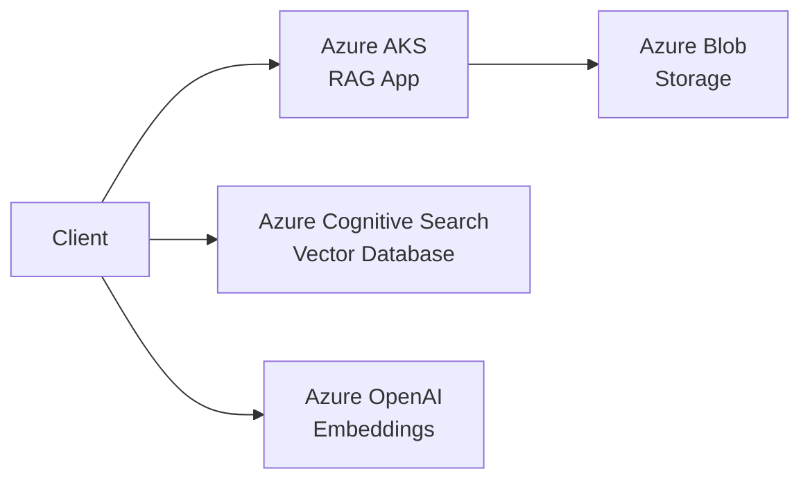

# RAG Application - Azure Deployment

A production-ready Retrieval-Augmented Generation (RAG) application deployed on Microsoft Azure with Kubernetes orchestration.

## Architecture

## Features

- ✅ Multi-PDF processing and vectorization
- ✅ Semantic search with vector embeddings
- ✅ Kubernetes orchestration with auto-scaling
- ✅ Azure Managed Identity for secure authentication
- ✅ Encryption at rest and in transit
- ✅ Network isolation with private endpoints
- ✅ Comprehensive monitoring and logging
- ✅ High availability with 3+ replicas

## Prerequisites

- Azure subscription
- Azure CLI (`az`)
- Terraform >= 1.0
- kubectl
- Docker
- Helm 3

## Quick Start

### 1. Clone Repository

git clone <repository-url>
cd rag-application

### 2. Configure Environment
cp .env.template .env
# Edit .env with your Azure details

### 3. Deploy Infrastructure

chmod +x scripts/deploy.sh
./scripts/deploy.sh

### 4. Update Kubernetes Secrets

Edit k8s/secret.yaml with your Azure resource credentials:
AZURE_STORAGE_CONNECTION_STRING: "<your-value>"
AZURE_SEARCH_API_KEY: "<your-value>"
AZURE_OPENAI_API_KEY: "<your-value>"

### 5. Verify Deployment

kubectl get pods -n rag-application
kubectl logs -f -n rag-application -l app=rag-application

